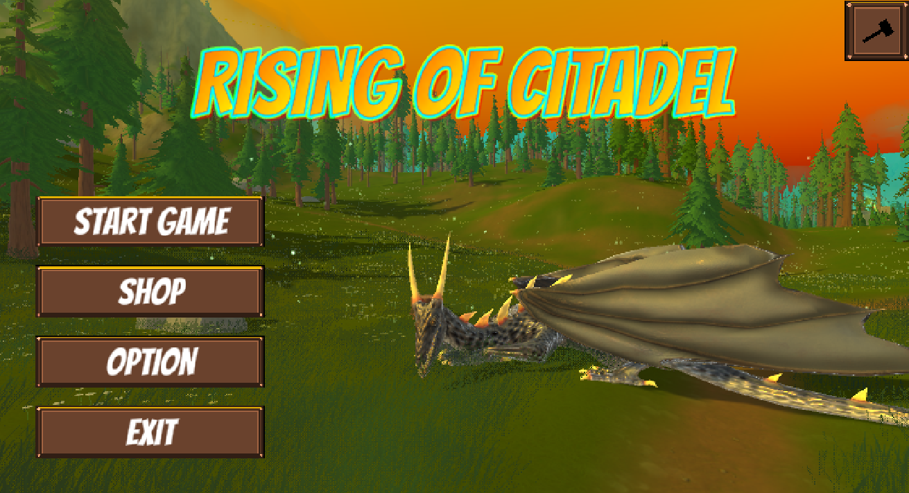
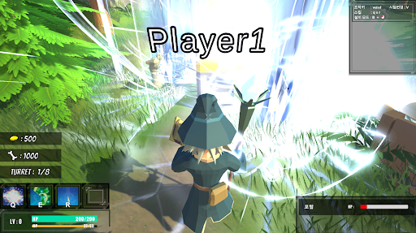
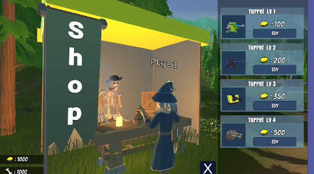

🇰🇷 한국어 | 🇺🇸 [English](README.md)

  <h2>🎮ROC 3D</h2>
  

---

## 📌 목차  

- [개요](#개요)  
- [게임 소개](#게임-소개)  
- [게임 특징](#게임-특징)  
- [조작법](#조작법)  
- [스크린샷 및 플레이 영상](#스크린샷-및-플레이-영상)  
- [사용 기술 스택](#사용-기술-스택)  
- [플레이](#플레이)
- [제작자](#제작자)  
- [출처](#출처)
  
---

## 🧩 개요

- **프로젝트명**: ROC 3D  
- **개발 기간**: 2022.06~2022.08  
- **사용 엔진**: Unity  
- **개발 언어**: C#  
- **팀 구성**: 4인 팀 (기획 1, 프로그래머 3)    

---

포탑을 설치하는 디펜스 요소와 캐릭터를 직접 조작하는 액션 요소를 결합한 게임입니다.  
플레이어는 성벽을 파괴하려는 몬스터를 막기 위해 포탑을 배치하고 캐릭터를 조작하여 전투를 진행합니다.

본 프로젝트는 전작 'Rise Of Citadel'을 3D로 업그레이드한 버전으로, 새로운 시각적 효과와 다양한 기능이 추가되었습니다.

2022년 충남 게임잼에 참여하여 개발되었습니다.  
https://www.youtube.com/watch?v=BxrM-qGS3-Q

---

## ⭐ 게임 특징

| 특징 | 설명 |
|------|------|
| 🏰 액션 + 디펜스 결합 | 포탑을 설치하는 디펜스 시스템과 캐릭터 직접 조작 전투가 결합된 게임 플레이 |
| ⚔️ 실시간 전투 | 캐릭터를 조작하여 성벽을 공격하는 몬스터를 직접 처치 |
| 🛡️ 포탑 전략 시스템 | 포탑을 설치하여 몬스터의 공격을 방어하는 전략 요소 |
| 🎮 3D 업그레이드 | 전작 'Rise Of Citadel'을 3D로 재구성하여 시각적 효과와 게임 기능 확장 |

---

## 🎮 조작법

| 동작 | 키 |
|------|----|
| 이동 | WASD |
| 카메라 회전 | 마우스 이동 |
| 기본 공격 | 마우스 좌클릭 |
| 스킬 사용 | Q / E / R |
| 상호작용 | F (상점, 보물상자, 포탈 등) |

---

## 🖼️ 스크린샷 및 ▶️ 플레이 영상

### 스크린샷

|  |  |
|:--:|:--:|
| 인게임 플레이 | 상점 시스템 |

### 플레이 영상

> ✨ https://www.youtube.com/watch?v=lwg1kScBunQ&feature=youtu.be

---

## 🛠️ 사용 기술 스택

- **Unity Engine**: Animator, 3D Scene 관리, UI 시스템, Physics 기반 상호작용 구현
- **C#**: 플레이어 전투 로직, 몬스터 AI, 스킬 처리, UI 로직 등 게임플레이 시스템 구현
- **GitHub**: 협업 및 버전 관리
- **Notion**: 기획 문서 및 회의 기록 관리
- **Discord**: 팀 커뮤니케이션 및 음성 회의

---

## 🚀 플레이

### A. 웹에서 플레이

> 🌐 https://play.unity.com/en/games/e9fe052c-ea60-411f-98af-89a62a156218/roc-3d-web-build

---

## 🙌 제작자

- 기획: **Minseok Seo**
- 개발: **CheonHyeok Moon**, **Hyunsoo Cho**, **Hohyun Kim**

---

감사합니다!  
즐거운 플레이 되세요 🎮

